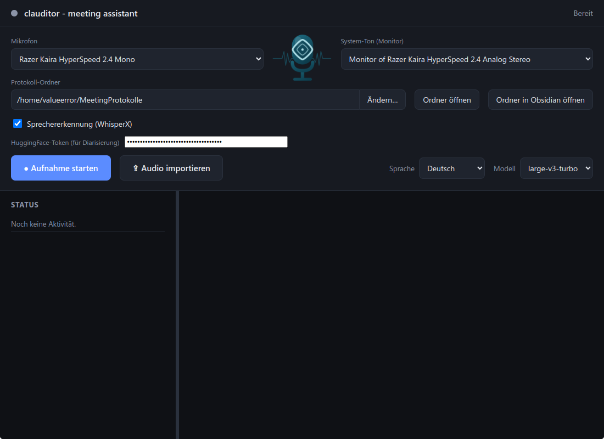

# clauditor – meeting assistant

**clauditor** (von **Claude** + **audit**) ist ein Electron/Vue-Tool, das **Mikrofon + System-Ton** gleichzeitig aufnimmt, **offline mit whisper.cpp** transkribiert und anschließend mit der lokal registrierten **Claude Code CLI** zu einem strukturierten Meeting-Protokoll zusammenfasst. Die Protokolle landen als `datum-uhrzeit.md` in einem Ordner; vorhandene Protokolle werden als Kontext mitgegeben, sodass Claude **Querverweise** (`[[datei.md]]`) und Zusammenhänge erzeugt.



## Features

- **Aufnahme von Mic + System-Ton** gleichzeitig, live gemischt – kein virtuelles Audiogerät nötig.
- **Offline-Transkription** mit whisper.cpp (kein Cloud-Upload).
- **Audio importieren**: beliebige Audiodatei (mp3, m4a, wav, flac, ogg …) ohne Aufnahme direkt transkribieren lassen.
- **Sprachauswahl** (Automatisch / Deutsch / Englisch) – explizite Wahl ist schneller und genauer.
- **Sprechererkennung (optional)** via WhisperX/pyannote – Claude ordnet Sprecher echten Namen zu, sofern sich jemand im Gespräch vorstellt, und listet alle **Anwesenden** am Protokollanfang.
- **Strukturiertes Markdown-Protokoll** mit Datum als Überschrift, Zusammenfassung, Themen, Entscheidungen und To-dos – inkl. Querverweisen zu früheren Protokollen.
- **Datenschutz-Regeln**: Claude nimmt nur fachlich Relevantes auf; Privates, Diffamierung, Hate Speech und Witze über Personen werden bewusst weggelassen.
- **Obsidian-Integration**: Protokoll-Ordner direkt als Vault öffnen.

## Funktionsweise

1. **Aufnahme / Import**: `ffmpeg` liest zwei PulseAudio/PipeWire-Quellen gleichzeitig – dein Mikrofon und den `.monitor` deines Ausgabegeräts – und mischt sie live (`amix`) zu einer 16-kHz-Mono-WAV. Importierte Dateien werden ins gleiche Format konvertiert.
2. **Transkription**: `nodejs-whisper` (whisper.cpp, lokal kompiliert) transkribiert die WAV offline. Mit aktivierter Sprechererkennung übernimmt stattdessen **WhisperX** Transkription + Diarisierung.
3. **Analyse**: Das Transkript geht zusammen mit allen vorhandenen `.md`-Protokollen an `claude -p` (Headless). Claude liefert das fertige Markdown-Protokoll zurück.
4. **Speichern**: Ablage als `YYYY-MM-DD_HH-MM.md` im gewählten Ordner.

## Voraussetzungen

- Linux mit PipeWire/PulseAudio (`pactl`, `parec`)
- `ffmpeg`
- Node.js 20+
- `claude` CLI installiert und eingeloggt
- Build-Tools für whisper.cpp: `cmake`, `make`, `gcc`/`g++`
- *(nur für Sprechererkennung)* [`uv`](https://docs.astral.sh/uv/) + HuggingFace-Token

## Setup

```bash
npm install
# einmalig: Modell laden + whisper.cpp bauen (Standardmodell: small)
node -e "require('nodejs-whisper/dist/autoDownloadModel').default(console,'small',false)"
```

## Starten

```bash
npm run dev
```

Im Fenster: Mikrofon + System-Ton (Monitor) wählen, Protokoll-Ordner setzen, **Aufnahme starten** → reden/Meeting → **Stoppen & Zusammenfassen**.

## Sprechererkennung (WhisperX)

Optional, einschaltbar über die Checkbox **„Sprechererkennung (WhisperX)"**. Was man wissen muss:

- **Einmaliger HuggingFace-Token nötig** (kostenlos): Lizenz von `pyannote/speaker-diarization-community-1` akzeptieren, einen **Read**-Token erstellen und im Feld eintragen. Die Links dazu sind direkt in der App verlinkt.
- **Automatische Installation**: Beim ersten Lauf richtet clauditor WhisperX selbst ein – über [`uv`](https://docs.astral.sh/uv/) wird eine isolierte Python-Umgebung (Python 3.12) angelegt und WhisperX installiert. Du brauchst also nur `uv` (bzw. eine passende Python-Basis), sonst nichts.
- **Ohne Haken läuft alles wie bisher** rein offline über whisper.cpp – kein Python, kein Token.
- **Ohne GPU** rechnet WhisperX auf der CPU; lange Aufnahmen dauern entsprechend.

## Modell wechseln

Über die Umgebungsvariable `CLAUDITOR_MODEL` (z. B. `medium`, `large-v3-turbo`). Neue Modelle werden beim ersten Lauf automatisch geladen und gebaut.

```bash
CLAUDITOR_MODEL=medium npm run dev
```

## Lizenz

Copyright (C) 2026 Thomas Weissel

clauditor ist freie Software unter der **GNU General Public License v3.0 oder später** (GPL-3.0-or-later). Du darfst das Programm weitergeben und/oder verändern – unter den Bedingungen der GPL. Den vollständigen Lizenztext findest du in der Datei [`LICENSE`](./LICENSE) oder unter <https://www.gnu.org/licenses/gpl-3.0.html>.
